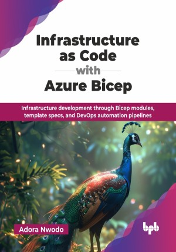

# Infrastructure as Code with Azure Bicep

Infrastructure development through Bicep modules, template specs, and DevOps automation pipelines.

This is the repository for [Infrastructure as Code with Azure Bicep
](https://bpbonline.com/products/infrastructure-as-code-with-azure-bicep?variant=44517529485512),published by BPB Publications.

## About the Book
Azure Bicep is a powerful language for deploying Azure resources declaratively, providing a simpler and more efficient alternative to JSON for creating Azure Resource Manager templates. It streamlines the process of defining, provisioning, and managing cloud infrastructure, making Infrastructure as Code (IaC) more accessible and effective.

This book provides a comprehensive guide to Azure Bicep, starting with an introduction to IaC, Bicep's core concepts, and a comparative analysis with ARM templates. It covers installation, setup, fundamental syntax, and practical template creation and deployment. Readers will learn to utilize variables, parameters, expressions, conditions, and loops for dynamic configurations. The book explores modularity through Bicep modules and template specs, as well as compilation and decompilation processes. Automation is emphasized with GitHub Actions and Azure DevOps CI/CD pipelines, including monitoring and troubleshooting. Advanced topics include scaling Bicep for large projects, secret management, cross-subscription deployments, and Policy as Code (PaC).

By the end of the book, you will have the tools and knowledge to implement IaC principles in your workflow, accelerating the development of reliable and scalable Azure cloud applications. You will be equipped to perform simple tasks like creating modular and reusable templates, managing configurations, as well as complex ones such as handling dependencies to design scalable and efficient infrastructure solutions.

## What You Will Learn
• Learn Azure Bicep from installation to advanced deployment automation with GitHub Actions and Azure DevOps.

• Implement variables, parameters, and template functions for dynamic resource configurations across multiple deployment scenarios.

• Compile, decompile, and migrate ARM templates to Bicep with effective dependency management.

• Create reusable modules using template specs and private registries for maintainable infrastructure components.

• Architect deployments with conditions, loops, and expressions optimized for large-scale enterprise environments.

• Automate deployments through CI/CD pipelines while managing secrets securely across complex infrastructures.

• Scale solutions with advanced dependency management, PaC, and cross-subscription deployment strategies.
